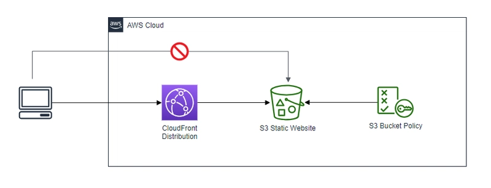

# Deploy a static website to S3 w/ Cloudfront



## How to develop
```
cd terraform
devbox shell

```

## 2. Configure Github Action access to AWS

```sh
terragrunt run --config root.hcl --backend-bootstrap -- init
```

### A. Creating an OIDC Provider in AWS IAM

For AWS to trust GitHub’s OIDC tokens, an OIDC provider must be created in IAM. This acts as a bridge between GitHub Actions and AWS, allowing workflows to authenticate dynamically.

1. Navigate to AWS IAM → Identity Providers and click Add Provider.
2. Select OpenID Connect (OIDC) as the provider type.
3. Enter GitHub’s OIDC URL: [https://token.actions.githubusercontent.com](https://token.actions.githubusercontent.com)
4. For the audience, use: s[ts.amazonaws.com‍](ts.amazonaws.com‍)
5. Click Add Provider to save the configuration.


### B. Configure an IAM Role for Github action

Now that we have the OIDC provider, Github can assume an IAM role, which we still need to create!

To create the IAM role:

- Navigate to AWS IAM → Roles and click Create Role.
- Select Web Identity and choose the GitHub OIDC provider created earlier.
- For the audience, enter sts.amazonaws.com.

Now, define a trust policy that limits role assumption to a specific repository and branch:

```json
{
  "Version": "2012-10-17",
  "Statement": [
    {
      "Effect": "Allow",
      "Principal": {
        "Federated": "arn:aws:iam::<AWS_ACCOUNT_ID>:oidc-provider/token.actions.githubusercontent.com"
      },
      "Action": "sts:AssumeRoleWithWebIdentity",
      "Condition": {
        "StringLike": {
          "token.actions.githubusercontent.com:sub": [
            "repo:<GITHUB_ORG>/<REPO>:ref:refs/heads/*",
            "repo:<GITHUB_ORG>/<REPO>:ref:refs/tags/*",
            "repo:<GITHUB_ORG>/<REPO>:ref:refs/pull/*"
          ]
        }
      }
    }
  ]
}
```

Replace <AWS_ACCOUNT_ID> with your AWS account ID.

Replace <GITHUB_ORG> and <REPO> with the GitHub organization and repository names.

This setup ensures that only workflows running on any branch of the specified repository can assume the role on push, workflow dispatch, tags and pull requests.

To grant access to all repositories within an organization, update the policy:

```json
"StringLike": {
  "token.actions.githubusercontent.com:sub": "repo:<GITHUB_ORG>/*"
}
```

### C. Attach IAM permissions to the role

Terraform needs to manage:

- S3 permissions if Terraform stores state files.
- DynamoDB permissions for state locking.
- CloudFront distribution

Attach the following permissions to the role: [iam_policy.tf_s3_cloudfront](iam_policy.tf_s3_cloudfront)

Once done, click Create Role and copy the Role ARN for use in GitHub Actions.

Go tyour repo's settings > Actions > Secrets and add the secret key AWS_ROLE_ARN with the ARN value you copied.

## 3. Deploy

This project uses **terragrunt** to keep the infrastructure **DRY**, i.e. reduce redundancy.

To deploy the whole stack, please run:

```sh
cd terraform/infrastructure-live
terragrunt apply --all
```

## Credits

- Daniel Amarán. **Comment déployer un site web sur Amazon S3 en utilisant Terraform ?** [alter-solutions.fr](alter-solutions.fr) [en ligne]. 23/01/2024. Disponible sur: [https://www.alter-solutions.fr/blog/site-web-amazon-s3-terraform](https://www.alter-solutions.fr/blog/site-web-amazon-s3-terraform)
- Firefly. **Integrating OIDC with Github Action to Manage Terraform Deployment on AWS**. [www.firefly.ai](www.firefly.ai) [en ligne]. Disponible sur: [https://www.firefly.ai/academy/integrating-oidc-with-github-action-to-manage-terraform-deployment-on-aws](https://www.firefly.ai/academy/integrating-oidc-with-github-action-to-manage-terraform-deployment-on-aws)
